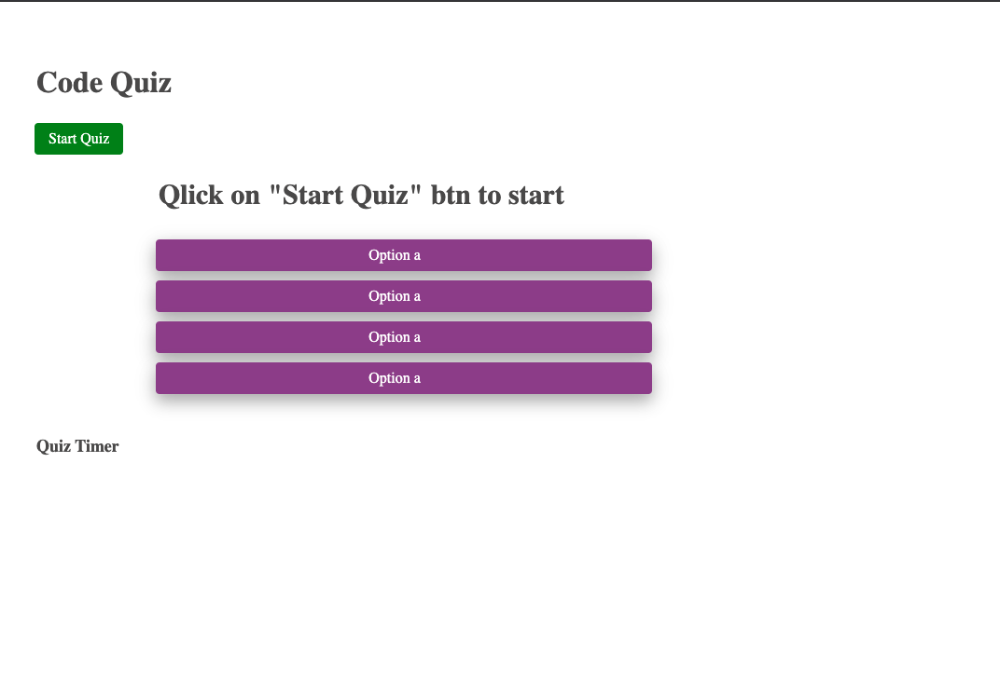

# CodeQuiz

#Description
This web application is to test skills in Javascript. Code Quiz contain 4 simple yet important basic questions one need to know to start his/her journey with javascript. Quiz is multiple-choice question that is a type of question that provides respondents with multiple answer options. Questions are timeboxed thus there is a limitation on time to complete the test.
This web application can be utilized further by adding additional and more complex questions to test more advanced level of knowledge of the user.

#Technology utilized
HTML and CSS was utilized for the front end of the web page. JavaScript is used to create questions and options as well as logic behind rendering questions, options, calculating scores based on correct/incorrect answers adding time for correct and deducting for incorrect asnwers.

#Usage
Please open the website using following link: https://zahramammadli.github.io/CodeQuiz/. In order to start the quiz please follow the following steps :

Please press the Start Button to start quiz.
Once clicked you will see first question and 4 options to choose and quiz timer started.
Once you clicked on one of multiple choice options you will see whether the answer was correct or not.
If answer was correct your timer will add 10 more seconds, if incorrect -10 second.
Right after choosing an answer you will be presented with the second question and so on until the end of the Quiz.
Once you have completed you will see your final score and will be asked to enter your name.
Your name and score will be saved in local storage.
You can retry the quiz if you press "Try Again" button at the end.

You can find screenshot of the page in the assets/images folder, follow link below:

PageLink
GitLink: https://zahramammadli.github.io/CodeQuiz/
GitHub: https://github.com/ZahraMammadli/CodeQuiz/
